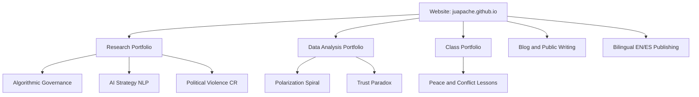

# JUAPACHE Operations Dashboard

Welcome to your control center for website operations, portfolio consistency, and publishing flow.

## Quick Start
- Primary website tasks: [to-do.md](to-do.md)
- Democracy project tasks: [to-do-democracy.md](to-do-democracy.md)
- Full technical audit: [WEBSITE_AUDIT_MARCH_2026.md](WEBSITE_AUDIT_MARCH_2026.md)
- English text input hub: [userinput.md](userinput.md)
- Spanish text input hub: [userinput_es.md](userinput_es.md)
- Site structure standards: [course-layout-standards.md](course-layout-standards.md)
- Main site overview: [README.md](README.md)

## Today Focus
- [ ] Update page copy in [userinput.md](userinput.md)
- [ ] Update ES copy in [userinput_es.md](userinput_es.md)
- [ ] Fix one critical issue from [WEBSITE_AUDIT_MARCH_2026.md](WEBSITE_AUDIT_MARCH_2026.md)
- [ ] Close one task from [to-do.md](to-do.md)
- [ ] Publish or improve one page/blog item

## Website Operations Center

### Health and Maintenance
- [ ] Verify sitemap coverage in [sitemap.xml](sitemap.xml)
- [ ] Verify crawl rules in [robots.txt](robots.txt)
- [ ] Check global styles and focus states in [style.css](style.css)
- [ ] Confirm broken links on teaching pages
- [ ] Confirm bilingual parity for core pages

### Content and Publishing
- [ ] Review home pages: [index.html](index.html), [index-es.html](index-es.html)
- [ ] Review section hubs: [research.html](research.html), [teaching.html](teaching.html), [data-lab.html](data-lab.html), [blog.html](blog.html)
- [ ] Review ES section hubs: [research-es.html](research-es.html), [teaching-es.html](teaching-es.html), [data-lab-es.html](data-lab-es.html)
- [ ] Check key long-form pages: [democracy-under-siege.html](democracy-under-siege.html), [democracia-en-crisis-cr.html](democracia-en-crisis-cr.html)
- [ ] Keep blog pipeline moving from draft to published

### Interactive Labs
- [ ] Trust Paradox EN: [trust-paradox.html](trust-paradox.html)
- [ ] Trust Paradox ES: [trust-paradox-es.html](trust-paradox-es.html)
- [ ] Polarization Spiral EN: [polarization-spiral.html](polarization-spiral.html)
- [ ] Polarization Spiral ES: [polarization-spiral-es.html](polarization-spiral-es.html)
- [ ] Prisoners Dilemma EN: [prisoners_dilemma_escalation.html](prisoners_dilemma_escalation.html)
- [ ] Prisoners Dilemma ES: [prisoners_dilemma_escalation-es.html](prisoners_dilemma_escalation-es.html)
- [ ] Prisoners Dilemma Part 2 EN: [prisoners_dilemma_escalation-parte2.html](prisoners_dilemma_escalation-parte2.html)
- [ ] Prisoners Dilemma Part 2 ES: [prisoners_dilemma_escalation-parte2-es.html](prisoners_dilemma_escalation-parte2-es.html)

## Missing Elements Tracker

### Critical (Fix First)
- [ ] Update sitemap to include all major pages: [sitemap.xml](sitemap.xml)
- [ ] Resolve missing teaching resources in ES flow: [teaching-es.html](teaching-es.html), [pdfs/README.md](pdfs/README.md)

### Medium Priority
- [ ] Replace placeholder blog content: [blog-posts/02-another-blog-post-title.html](blog-posts/02-another-blog-post-title.html)
- [ ] Add transparent status labels to coming soon cards
- [ ] Add/expand structured metadata where relevant

### Quality and Growth
- [ ] Keep EN and ES sections aligned after each update
- [ ] Add one measurable improvement per weekly cycle
- [ ] Record what changed and why in a short note

## Text and Translation Workflow
1. Edit source text in [userinput.md](userinput.md) and [userinput_es.md](userinput_es.md).
2. Apply updates to website pages.
3. Spot-check key pages for layout or text overflow.
4. Validate navigation, links, and visual consistency.
5. Mark completed tasks in [to-do.md](to-do.md).

## Portfolio Connections

### Website Core
- [README.md](README.md)
- [to-do.md](to-do.md)
- [WEBSITE_AUDIT_MARCH_2026.md](WEBSITE_AUDIT_MARCH_2026.md)

### Class Portfolio
- [Class Overview](../../Class-Portfolio/README.md)
- [Class To-Do](../../Class-Portfolio/to-do.md)
- [Intro Course Root](../../Class-Portfolio/01-intro-peace-conflict-studies/README.md)

### Research Portfolio
- [Research Overview](../../Research-Portfolio/README.md)
- [Research To-Do](../../Research-Portfolio/to-do.md)
- [Algorithmic Governance](../../Research-Portfolio/02-algorithmic-governance/README.md)
- [AI Strategy NLP](../../Research-Portfolio/05-ai-strategy-nlp/README.md)
- [Political Violence Costa Rica](../../Research-Portfolio/07-political-violence-costarica/c%C3%B3mo-mueren-democracias/README.md)

### Data Analysis Portfolio
- [Data Analysis Overview](../../Data-Analysis-Portfolio/README.md)
- [Data Analysis To-Do](../../Data-Analysis-Portfolio/to-do.md)
- [Polarization Spiral Docs](../../Data-Analysis-Portfolio/03-data-visualization/polarization-spiral/START_HERE.md)
- [Trust Paradox Docs](../../Data-Analysis-Portfolio/03-data-visualization/trust-paradox/START_HERE.md)

## Weekly Review Board

### This Week
- Top 3 outcomes:
  - [ ]
  - [ ]
  - [ ]
- Biggest blocker:
- Decision needed:

### Next Week
- Main delivery:
- Supporting tasks:
  - [ ]
  - [ ]
  - [ ]

## Suggestions Inbox
- Product suggestion:
- UX suggestion:
- Research suggestion:
- Teaching suggestion:
- Automation suggestion:

## Project Connections Map

## Operating Rhythm
- Daily: close at least one small task and one quality check.
- Weekly: complete one structural improvement and one content improvement.
- Monthly: refresh audit priorities and remove outdated tasks.
